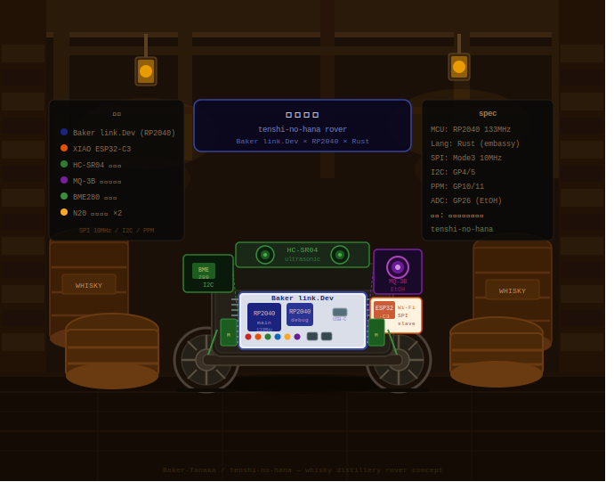

# Angel's Nose - ROS2 × Baker link. Dev × Rover

> ⚠️ This project is under active development. Features, wiring, and documentation may change.

**A whiskey barrel patrol rover that detects alcohol vapor, environmental conditions, and barrel liquid level.**




> 日本語版はこちら: [README.ja.md](./README.ja.md)

## Overview
Angel's Nose is a compact 2-wheel rover based on the Baker link. Dev(RP2040) board. It patrols distilleries and barrel aging warehouses, detects ethanol vapor, measures temperature, humidity, and pressure, and estimates barrel liquid surface using magnetic sensing.

This project combines:
- **Baker link. Dev (RP2040)**
- **XIAO-ESP32-C3 as a Wi-Fi ESP-hosted MCU**
- **Embassy-rs no_std async runtime**
- **zenoh-ros2-nostd** for ROS2-compatible messaging

## Key features
- Ethanol vapor detection as a proxy for the barrel's "angel's share"
- Environmental sensing with temperature, humidity, and pressure
- Non-contact barrel liquid level sensing using a floating magnet and magnetic field sensor
- Wi-Fi communication via XIAO-ESP32-C3
- Low-cost and lightweight no_std embedded design

## Hardware bill of materials
Estimated Japan-focused pricing as of April 2026.

| Part               | Example                                              | Approx. Price | Link                                                            | Notes                                           |
| ------------------ | ---------------------------------------------------- | ------------- | --------------------------------------------------------------- | ----------------------------------------------- |
| 2WD robot chassis  | FT-DC-002 / 2WD Mini Smart Robot Mobile Platform Kit | ¥1,900        | [Akizuki](https://akizukidenshi.com/catalog/g/g113651/)         | Includes motors; encoder-free version available |
| Baker link. Dev    | -                                                    | ¥1,980        | [Switch Science](https://www.switch-science.com/products/10044) | Native Embassy-rs / Rust no_std support         |
| Motor driver       | DRV8835 dual motor driver                            | ¥400–1,395    | [Akizuki](https://akizukidenshi.com/catalog/g/g109848/)         | Ideal for direct PWM motor control              |
| Ethanol sensor     | MQ-3B or MQ-3 module                                 | ¥450          | [Akizuki](https://akizukidenshi.com/catalog/g/g116269/)         | Main sensor for vapor detection                 |
| Environment sensor | BME280 module (AE-BME280)                            | ¥1,650        | [Switch Science](https://www.switch-science.com/products/2236)  | Required for evaporation compensation           |
| Optional IMU       | 6-axis IMU module                                    | ¥990          | [Switch Science](https://www.switch-science.com/products/8695)  | Useful for odometry and attitude estimation     |
| Ultrasonic sensor  | -                                                    | ¥300          | [Switch Science](https://www.switch-science.com/products/8224/) | For obstacle avoidance                          |

```
GPIOs: CLK:6 MOSI:7 MISO:5 CS:10 HS:3 DR:4
```

## Wiring


## Wireless stack
- Uses **XIAO-ESP32-C3** with ESP-hosted MCU firmware
- Uses the `external/embassy` submodule and `embassy-net-esp-hosted` from the `upstream-esp-hosted-mcu` fork

## Software stack
- `zenoh-ros2-nostd`
- Custom message support for `angel_nose_msgs` (ethanol level, liquid height, environment data)

## How it works
1. Position the rover at a fixed distance from the barrel. ArUco or AprilTag tracking is recommended.
2. Measure barrel liquid level with a floating cork and neodymium magnet using magnetic field sensing.
3. Use the MQ-3 sensor to "sniff" ambient ethanol vapor.

## Future work
- Autonomous mapping and multi-barrel patrol
- Estimating evaporation volume from liquid level data
- Web dashboard for distillery monitoring
- Full Rust no_std implementation across the stack

## ESP32-Hosted (ESP32-C3) pin mapping
Pin assignments are extracted from `sdkconfig`.

> Reference: [Seeed Studio XIAO ESP32C3 Getting Started](https://wiki.seeedstudio.com/XIAO_ESP32_C3_Getting_Started/)

### XIAO ESP32C3 GPIO ↔ physical pin mapping

| XIAO pin | GPIO   | Default function | Notes                         |
| -------- | ------ | ---------------- | ----------------------------- |
| D0       | GPIO2  | ADC              | ⚠️ Strapping pin               |
| D1       | GPIO3  | ADC              |                               |
| D2       | GPIO4  | ADC              | MTMS (JTAG)                   |
| D3       | GPIO5  | ADC              | MTDI (JTAG)                   |
| D4       | GPIO6  | SDA (I2C)        | FSPICLK, MTCK (JTAG)          |
| D5       | GPIO7  | SCL (I2C)        | FSPID, MTDO (JTAG)            |
| D6       | GPIO21 | UART TX          |                               |
| D7       | GPIO20 | UART RX          |                               |
| D8       | GPIO8  | SPI SCK          | ⚠️ Strapping pin               |
| D9       | GPIO9  | SPI MISO         | ⚠️ Strapping pin / BOOT button |
| D10      | GPIO10 | SPI MOSI         | FSPICS0                       |

### Recommended esp-hosted slave wiring

> Avoid all strapping pins (GPIO2/8/9) for stable operation.

| Signal     | GPIO   | XIAO pin | Purpose                   |
| ---------- | ------ | -------- | ------------------------- |
| SPI MOSI   | GPIO7  | D5       | Required                  |
| SPI MISO   | GPIO5  | D3       | Required                  |
| SPI CLK    | GPIO6  | D4       | Required                  |
| SPI CS     | GPIO10 | D10      | Required                  |
| Handshake  | GPIO3  | D1       | Timing sync               |
| Data Ready | GPIO4  | D2       | Data arrival notification |
| Reset      | GPIO21 | D6       | Recommended               |

#### Changes from previous wiring

| Signal   | Old GPIO   | New GPIO    | Reason                                   |
| -------- | ---------- | ----------- | ---------------------------------------- |
| SPI MISO | GPIO2 (D0) | GPIO5 (D3)  | Avoid strapping pin and boot instability |
| Reset    | none       | GPIO21 (D6) | Add host reset control                   |

#### Spare pins

| XIAO pin | GPIO   | Notes                            |
| -------- | ------ | -------------------------------- |
| D0       | GPIO2  | Spare, but avoid strapping pin   |
| D7       | GPIO20 | Spare UART RX for debugging      |
| D8       | GPIO8  | Spare, but avoid strapping pin   |
| D9       | GPIO9  | Spare, but avoid BOOT button pin |

### ESP-IDF menuconfig setup

```powershell
idf.py menuconfig
```

Navigate to **Example Configuration → Bus Config → SPI Full-Duplex Configuration** and set:

| Option            | Value |
| ----------------- | ----- |
| SPI MOSI (GPIO)   | 7     |
| SPI MISO (GPIO)   | 5     |
| SPI CLK (GPIO)    | 6     |
| SPI CS (GPIO)     | 10    |
| Handshake (GPIO)  | 3     |
| Data Ready (GPIO) | 4     |
| Reset pin (GPIO)  | 21    |

Save and rebuild.

```bash
# Create esp-hosted-mcu slave sample (ESP-IDF v5.3+ assumed)
idf.py create-project-from-example "espressif/esp_hosted:slave"
cd slave
idf.py set-target esp32c3
idf.py menuconfig
# Set SPI Full-Duplex Configuration:
#   MISO=5, MOSI=7, CLK=6, CS=10, HS=3, DR=4
#   Reset GPIO=21
idf.py build flash
```

## Submodule setup

RP2040-side dependencies are managed via git submodules:

```bash
git submodule update --init --recursive external/embassy external/zenoh_ros2_nostd
```
