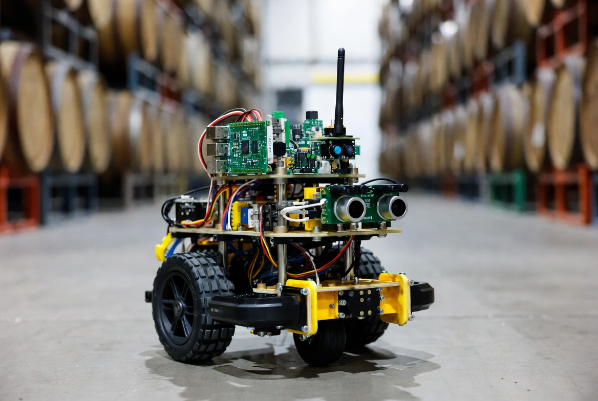
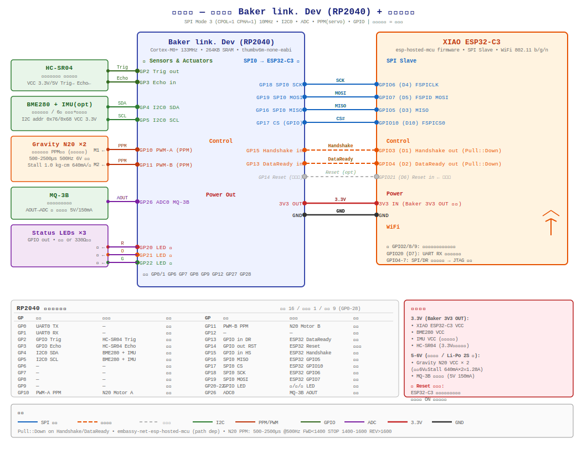

# 天使の鼻 (Angel's Nose) - ROS2 × Baker link. Dev(RP2040) 巡回ローバー

**ウィスキー樽の「天使の分け前」を嗅ぎながら、樽の中の水位まで監視する巡回ロボット**

※完成イメージ



（画像：倉庫のウィスキー樽保管庫で嗅ぎ回る姿）

## コンセプト
「天使の分け前（Angel's Share）」ならぬ **「天使の鼻（Angel's Nose）」**。
2輪ローバーが蒸留所・熟成庫内を自律巡回し、空気中のアルコール濃度（エタノール蒸気）、温湿度、気圧を計測。さらに磁界センサーを使って樽内の液面（ウィスキーの減り具合「天使の分け前」）を非接触で測定します。

**bakerlink.dev + ROS2 + Embassy-rs (Rust)** を活用した、軽量・低コスト・無線対応のスマート監視システムです。

## 主な特徴
- エタノール蒸気（天使の分け前）検知
- 温湿度・気圧センシング（蒸発量補正用）
- 磁界センサーによる樽内液面（水位）測定（浮遊ネオジム磁石方式）
- ROS2（またはEmbassy-rs）による制御・ナビゲーション
- XIAO-ESP32-C3によるWi-Fi/無線通信
- 低コスト（本体6,500〜9,500円程度）

## ハードウェア BOM（最安志向・日本国内中心・2026年4月時点）

| 部品名               | 具体品番・おすすめ                                   | 価格目安（税込） | 購入URL                                                             | 備考                                 |
| -------------------- | ---------------------------------------------------- | ---------------- | ------------------------------------------------------------------- | ------------------------------------ |
| 2WDロボットシャーシ  | FT-DC-002 / 2WD Mini Smart Robot Mobile Platform Kit | ¥1,900           | [秋月電子](https://akizukidenshi.com/catalog/g/g113651/)            | モーター付き、エンコーダ無し版もあり |
| Baker link. Dev      | -                                                    | ¥1,980           | [スイッチサイエンス](https://www.switch-science.com/products/10044) | Embassy-rsでRust no_std完璧対応      |
| モータドライバ       | デュアルモータードライバDRV8835                      | ¥400〜1,395      | [秋月電子](https://akizukidenshi.com/catalog/g/g109848/)            | PWM直駆動に最適                      |
| エタノールセンサー   | MQ-3B (またはMQ-3モジュール)                         | ¥450             | [秋月電子](https://akizukidenshi.com/catalog/g/g116269/)            | 天使の分け前検知の主役               |
| 温湿度・気圧センサー | BME280 モジュール (AE-BME280)                        | ¥1,650           | [スイッチサイエンス](https://www.switch-science.com/products/2236)  | 蒸発量補正に必須                     |
| IMU (オプション)     | 6軸IMUセンサーモジュール                             | ¥990             | [スイッチサイエンス](https://www.switch-science.com/products/8695)  | odom計算・姿勢推定用                 |
| 超音波センサー       |                                                      | ¥300             | [スイッチサイエンス](https://www.switch-science.com/products/8224/) | 障害物回避                           |


```
GPIOs: CLK:6 MOSI:7 MISO:5 CS:10 HS:3 DR:4
```

## 配線図



## 無線通信
- **XIAO-ESP32-C3** を使用（ESP-Hosted-MCU）
- `external/embassy` サブモジュール（`https://github.com/oktima/embassy-fork.git` の `upstream-esp-hosted-mcu`）に含まれる `embassy-net-esp-hosted` を使用

## ソフトウェア構成
- **zenoh-ros2-nostd**
- カスタムメッセージ：`angel_nose_msgs`（エタノール濃度、液面高さ、環境データ）

## 設置・測定方法
1. 樽の横に固定距離で横付け（ArUcoマーカー or AprilTag推奨）
2. 浮遊コルク＋ネオジム磁石で液面を磁場強度として検知（ホールセンサー or 3軸磁力計使用）
3. MQ-3で周囲エタノール蒸気濃度を「鼻」で嗅ぐ

## 今後の拡張予定
- 複数樽自動巡回マッピング
- 液面データから天使の分け前蒸発量の推定
- Webダッシュボード（蒸留所監視用）
- 完全Rust no_std実装

---

**関連リンク**：  
- X: [@BakerlinkLab](https://x.com/BakerlinkLab)

---

「天使の鼻で、ウィスキーの息吹を嗅ぐ。」🥃✨
配線図・回路図・キャリブレーション方法・ROS2パッケージが完成したら、随時追加していきます！

## ESP32-Hosted（ESP32-C3）

`sdkconfig` から、現在のピンアサインを抜き出しました。

> **参考**: [Seeed Studio XIAO ESP32C3 Getting Started](https://wiki.seeedstudio.com/XIAO_ESP32C3_Getting_Started/)

### XIAO ESP32C3 GPIO ↔ 物理ピン対応表

| XIAO ピン | GPIO   | デフォルト機能 | 備考                                  |
| --------- | ------ | -------------- | ------------------------------------- |
| **D0**    | GPIO2  | ADC            | ⚠️ **ストラッピングピン**              |
| **D1**    | GPIO3  | ADC            |                                       |
| **D2**    | GPIO4  | ADC            | MTMS (JTAG)                           |
| **D3**    | GPIO5  | ADC            | MTDI (JTAG)                           |
| **D4**    | GPIO6  | **SDA (I2C)**  | FSPICLK, MTCK (JTAG)                  |
| **D5**    | GPIO7  | **SCL (I2C)**  | FSPID, MTDO (JTAG)                    |
| **D6**    | GPIO21 | TX (UART)      |                                       |
| **D7**    | GPIO20 | RX (UART)      |                                       |
| **D8**    | GPIO8  | SPI SCK        | ⚠️ **ストラッピングピン**              |
| **D9**    | GPIO9  | SPI MISO       | ⚠️ **ストラッピングピン / BOOTボタン** |
| **D10**   | GPIO10 | SPI MOSI       | FSPICS0                               |

### Seeed Studio XIAO ESP32C3 の esp-hosted Slave ピン割り当て（推奨構成）

> ストラッピングピン（GPIO2/8/9）を **すべて回避** した安全な構成です。

| 信号名         | GPIO   | XIAO 物理ピン | 接続方式        | 用途                   |
| -------------- | ------ | ------------- | --------------- | ---------------------- |
| **SPI MOSI**   | GPIO7  | **D5**        | FSPID（専用）   | 必須                   |
| **SPI MISO**   | GPIO5  | **D3**        | GPIO Matrix     | 必須                   |
| **SPI CLK**    | GPIO6  | **D4**        | FSPICLK（専用） | 必須                   |
| **SPI CS**     | GPIO10 | **D10**       | FSPICS0（専用） | 必須                   |
| **Handshake**  | GPIO3  | **D1**        | GPIO            | 重要（タイミング同期） |
| **Data Ready** | GPIO4  | **D2**        | GPIO            | 重要（データ到着通知） |
| **Reset**      | GPIO21 | **D6**        | GPIO            | 推奨（リセット制御）   |

#### 旧構成からの変更点

| 信号名   | 旧 GPIO      | 新 GPIO      | 変更理由                                    |
| -------- | ------------ | ------------ | ------------------------------------------- |
| SPI MISO | GPIO2（D0）⚠️ | GPIO5（D3）  | GPIO2 はストラッピングピン → 起動不安定回避 |
| Reset    | -1（無効）   | GPIO21（D6） | ホスト側からのリセット制御を有効化          |

#### 空きピン

| XIAO ピン | GPIO   | 状態                                 |
| --------- | ------ | ------------------------------------ |
| **D0**    | GPIO2  | 空き（⚠️ ストラッピング：未使用推奨） |
| **D7**    | GPIO20 | 空き（UART RX — デバッグ用に確保）   |
| **D8**    | GPIO8  | 空き（⚠️ ストラッピング：未使用推奨） |
| **D9**    | GPIO9  | 空き（⚠️ BOOTボタン：未使用推奨）     |

### menuconfig での設定手順

```powershell
idf.py menuconfig
```

→ **Example Configuration → Bus Config → SPI Full-Duplex Configuration** で以下を設定：

| 設定項目          | 値     |
| ----------------- | ------ |
| SPI MOSI (GPIO)   | **7**  |
| SPI MISO (GPIO)   | **5**  |
| SPI CLK (GPIO)    | **6**  |
| SPI CS (GPIO)     | **10** |
| Handshake (GPIO)  | **3**  |
| Data Ready (GPIO) | **4**  |
| Reset pin (GPIO)  | **21** |

→ 保存 → 再ビルド・フラッシュ。


```bash
# esp-hosted-mcu の slave サンプルを作成
# (ESP-IDF v5.3 以降を想定)
idf.py create-project-from-example "espressif/esp_hosted:slave"
cd slave
idf.py set-target esp32c3
idf.py menuconfig
# → Example Configuration → Bus Config in between Host and Co-processor
#   → SPI Full-Duplex Configuration → GPIO設定:
#   MISO=5, MOSI=7, CLK=6, CS=10, HS=3, DR=4
#   Reset GPIO=21
idf.py build flash
```

RP2040側の依存は本リポジトリのサブモジュールで管理します。

```bash
git submodule update --init --recursive external/embassy external/zenoh_ros2_nostd
```
